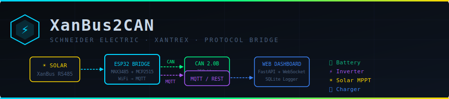

# XanBus → CAN Bridge

<p align="center">
  
</p>

<p align="center">
  
  
  
  
  
  
</p>

> **XanBus2CAN** converts Schneider Electric / Xantrex XanBus (NMEA 2000 over RS485) to standard CAN 2.0B — with MQTT logging, SQLite/CSV data capture and a live web dashboard. Supports XW+, MPPT 80-600, SW Plus and all XanBus-compatible devices.

---

## 📋 Table of Contents

- [Features](#-features)
- [Architecture](#-architecture)
- [Hardware Setup](#-hardware-setup)
- [Software Setup](#-software-setup)
- [Usage](#-usage)
- [Supported Devices & PGNs](#-supported-devices--pgns)
- [CAN Frame Map](#-can-frame-map)
- [MQTT Topics](#-mqtt-topics)
- [Web Dashboard](#-web-dashboard)
- [Project Structure](#-project-structure)
- [License](#-license)

---

## ✨ Features

- **Full XanBus decoder** — all Schneider PGNs including proprietary extensions
- **CAN 2.0B output** @ 250 kbps via MCP2515 (ESP32) or socketcan (Python)
- **MQTT logging** — JSON payloads for every subsystem, configurable broker
- **SQLite + CSV data logging** — persistent time-series for analysis
- **FastAPI REST + WebSocket server** — powers the live web GUI
- **Real-time web dashboard** — power flow diagram, charts, protocol log
- **Fast-packet reassembly** — multi-frame NMEA 2000 messages handled correctly
- **Demo mode** — runs without any hardware for development/testing
- **ESP32 firmware** — standalone RS485→CAN bridge with WiFi MQTT reporting

---

## 🏗 Architecture

```
┌──────────────────────────────────────────────────────────────────────┐
│                                                                      │
│   Schneider XW+        Schneider MPPT        Schneider SW Plus      │
│   Inverter/Charger     Solar Controller      Inverter               │
│        │                     │                     │                │
│        └─────────────────────┴─────────────────────┘                │
│                              │                                       │
│                        XanBus RS485                                  │
│                        250 kbps                                      │
│                              │                                       │
│               ┌──────────────▼──────────────┐                       │
│               │          ESP32              │                       │
│               │  ┌────────────────────┐     │                       │
│               │  │  MAX3485 / RS485   │     │◄── 3.3V / USB power  │
│               │  └────────┬───────────┘     │                       │
│               │           │ UART2 250kbps   │                       │
│               │  ┌────────▼───────────┐     │                       │
│               │  │  XanBus Decoder    │     │                       │
│               │  │  PGN Parser        │     │                       │
│               │  └────────┬───────────┘     │                       │
│               │           │                 │                       │
│               │  ┌────────▼───────────┐     │                       │
│               │  │  MCP2515 (SPI)     ├─────┼──► CAN Bus 250kbps   │
│               │  └────────────────────┘     │                       │
│               │                             │                       │
│               │  WiFi ──────────────────────┼──► MQTT Broker       │
│               └─────────────────────────────┘                       │
│                                                                      │
│               ┌─────────────────────────────┐                       │
│               │   Python Host (optional)    │                       │
│               │   xanbus_bridge.py          │                       │
│               │   ├── XanBus Decoder        ├──► CAN (socketcan)   │
│               │   ├── FastAPI :8080         ├──► MQTT              │
│               │   ├── SQLite Logger         ├──► xanbus_data.db    │
│               │   └── CSV Logger            └──► logs/*.csv        │
│               └──────────────┬──────────────┘                       │
│                              │ WebSocket / REST                     │
│               ┌──────────────▼──────────────┐                       │
│               │   Web Dashboard :8080       │                       │
│               │   Live power flow + charts  │                       │
│               └─────────────────────────────┘                       │
└──────────────────────────────────────────────────────────────────────┘
```

---

## 🔧 Hardware Setup

### Components

| Part | Description | Notes |
|------|-------------|-------|
| ESP32 DevKit v1 | Main MCU | Any ESP32 with ≥2 UARTs |
| MAX3485 / SN65HVD72 | RS485 transceiver | 3.3V compatible |
| MCP2515 + TJA1050 | CAN controller + transceiver | SPI module |
| RJ45 cable | For XanBus connection | Patch cable |
| 120Ω resistor ×2 | CAN bus termination | At each bus end |

### ESP32 Pin Connections

```
ESP32 Pin          Signal              Connect To
─────────────────────────────────────────────────────
GPIO 16 (RX2)  ── RS485 RO       ─── MAX3485 pin 1
GPIO 17 (TX2)  ── RS485 DI       ─── MAX3485 pin 4
GPIO  4        ── RS485 DE       ─── MAX3485 pin 3  (Driver Enable)
GPIO  5        ── RS485 /RE      ─── MAX3485 pin 2  (Receiver Enable, active LOW)
GPIO 18 (SCK)  ── SPI SCK        ─── MCP2515 pin 13
GPIO 23 (MOSI) ── SPI MOSI       ─── MCP2515 pin 14 (SI)
GPIO 19 (MISO) ── SPI MISO       ─── MCP2515 pin 15 (SO)
GPIO  5 (CS)   ── SPI CS         ─── MCP2515 pin 16 (CS)
GPIO 15        ── CAN INT        ─── MCP2515 pin 12 (INT)
3.3V           ── VCC            ─── MAX3485 VCC, MCP2515 VCC
GND            ── GND            ─── MAX3485 GND, MCP2515 GND

MAX3485 A (+)  ─────────────────── XanBus A (RJ45 Pin 1)
MAX3485 B (−)  ─────────────────── XanBus B (RJ45 Pin 2)
MCP2515 CANH   ─────────────────── CAN Bus High
MCP2515 CANL   ─────────────────── CAN Bus Low
```

### Schneider XanBus RJ45 Pinout

```
     ┌───────────────┐
     │ 1 2 3 4 5 6 7 8│  (looking into the RJ45 plug)
     └───────────────┘
Pin 1: XanBus A (+)  ← Connect to RS485 A
Pin 2: XanBus B (−)  ← Connect to RS485 B
Pin 3: Shield / GND
Pin 4: +12V DC (500mA max — optional power)
Pin 5: Power GND
Pin 6: Shield / GND
Pin 7: XanBus A (duplicate)
Pin 8: XanBus B (duplicate)
```

> ⚠️ **Important:** Add 120Ω termination resistors between A and B at **both physical ends** of the XanBus cable run.

---

## 💻 Software Setup

### Python (Host Bridge)

```bash
# Clone repo
git clone https://github.com/YOUR_USERNAME/xanbus2can.git
cd xanbus2can

# Install dependencies
pip install -r requirements.txt

# Run in demo mode (no hardware needed)
python python/xanbus_bridge.py --demo

# Run with real hardware
python python/xanbus_bridge.py --port /dev/ttyUSB0 --mqtt 192.168.1.100
```

### ESP32 Firmware (PlatformIO)

```bash
cd esp32

# Install PlatformIO CLI if needed
pip install platformio

# Edit WiFi + MQTT credentials in xanbus2can_firmware.ino:
#   const char* WIFI_SSID     = "YOUR_SSID";
#   const char* WIFI_PASSWORD = "YOUR_PASSWORD";
#   const char* MQTT_BROKER   = "192.168.1.100";

# Build and flash
pio run --target upload

# Monitor serial output
pio device monitor --baud 115200
```

### ESP32 Firmware (Arduino IDE)

1. Install **ESP32 board package** via Board Manager
2. Install libraries: `mcp2515` (autowp), `PubSubClient`, `ArduinoJson`
3. Open `esp32/xanbus2can_firmware.ino`
4. Edit WiFi/MQTT credentials
5. Select board: **ESP32 Dev Module**, upload

---

## 🚀 Usage

### CLI Options

```bash
python python/xanbus_bridge.py [OPTIONS]

Options:
  --port  PORT   RS485 serial port     (default: /dev/ttyUSB0)
  --baud  BAUD   Serial baud rate      (default: 250000)
  --mqtt  HOST   MQTT broker address   (default: localhost)
  --can   CHAN   CAN channel           (default: can0)
  --demo         Demo mode, no hardware required
```

### Enable Virtual CAN (Linux)

```bash
sudo modprobe vcan
sudo ip link add dev vcan0 type vcan
sudo ip link set up vcan0
python python/xanbus_bridge.py --can vcan0 --demo

# Monitor CAN frames
candump vcan0
```

### Open Web Dashboard

```
http://localhost:8080
```

---

## 📡 Supported Devices & PGNs

### Schneider / Xantrex Devices

| Device | Type | PGNs |
|--------|------|------|
| XW+ 6848 / 5548 | Inverter/Charger | Battery, Inverter, Charger, AC I/O |
| MPPT 80-600 | Solar Controller | Solar, History |
| MPPT 60-150 | Solar Controller | Solar |
| SW Plus 2524 / 3024 | Inverter | Inverter, AC Output |
| SCP (Control Panel) | Display | System Mode, Faults |
| AGS (Auto Gen Start) | Generator | Generator Status |
| XW-Battery Monitor | BMS Interface | Battery Extended |

### Decoded PGNs

| PGN | Dec | Name | Data |
|-----|-----|------|------|
| 0x1F214 | 127508 | DC Battery Status | Voltage, Current, Temperature |
| 0x1F213 | 127507 | DC Detailed Status | SOC, Capacity |
| 0x1F218 | 127512 | Solar Controller Status | PV Voltage/Current/Power, State |
| 0x1F219 | 127513 | Solar Controller History | Daily/Total yield |
| 0x1F21D | 127517 | Inverter Status | AC Voltage/Current, State |
| 0x1F21F | 127519 | Inverter AC Status | AC V/I/Hz |
| 0x1F21C | 127516 | Charger Status | Output V/I, Input V/I, Mode |
| 0x1F21E | 127518 | Charger AC Status | Input V/I/Hz |
| 0x1F211 | 127505 | AC Input Status | V, Hz |
| 0x1F212 | 127506 | AC Output Status | V, Hz |
| 0x1EF00 | 126996 | Product Information | Model, SW version |
| 0x1FF00 | — | XanBus Battery Ext *(proprietary)* | SOC, State |
| 0x1FF01 | — | XanBus System Mode *(proprietary)* | Off/Sell/Island/… |
| 0x1FF02 | — | XanBus Fault Status *(proprietary)* | Code, Severity |

---

## 🔌 CAN Frame Map

All values are little-endian signed/unsigned integers.

| CAN ID | Name | Byte Layout |
|--------|------|-------------|
| `0x100` | Battery Pack | `V×100(i16)` `I×10(i16)` `T_K×100(i16)` `SOC×10(u16)` |
| `0x101` | Battery SOC | `SOC×100(u16)` `Cap_Ah(u16)` `State(u8)` |
| `0x110` | Solar Basic | `PV_V×100(i16)` `PV_I×100(i16)` `PV_W(u16)` `Out_V×100(u16)` |
| `0x111` | Solar Detail | `Out_I×10(i16)` `State(u8)` `Instance(u8)` |
| `0x120` | Inverter AC | `AC_V×10(i16)` `AC_I×10(i16)` `Hz×100(i16)` `W(u16)` |
| `0x121` | Inverter State | `State(u8)` `DC_V×100(i16)` |
| `0x130` | Charger DC | `Out_V×100(i16)` `Out_I×10(i16)` `In_V×10(i16)` `In_I×10(i16)` |
| `0x131` | Charger State | `Mode(u8)` `Instance(u8)` |
| `0x150` | Fault/Warning | `Source(u8)` `Code(u16)` `Severity(u8)` |

---

## 📨 MQTT Topics

```
xanbus/battery    {"voltage":48.2,"current":15.3,"soc":78.1,"temp":24.5,"capacity_ah":200}
xanbus/solar      {"pv_voltage":112.4,"pv_current":16.3,"pv_power":1840,"state":"MPPT","daily_yield_wh":4200}
xanbus/inverter   {"ac_voltage":230.1,"ac_current":5.8,"ac_frequency":50.01,"ac_power":1334,"state":"Inverting"}
xanbus/charger    {"output_voltage":54.2,"output_current":18.0,"input_voltage":230,"mode":"Bulk"}
xanbus/fault      {"source":12,"code":2561,"severity":"Warning","ts":1709123456.789}
xanbus/status     {"uptime_s":3600,"frames_total":43200,"crc_errors":0,"wifi_rssi":-62}
```

---

## 🖥 Web Dashboard

<p align="center">
  
</p>

Features:
- **Power flow diagram** — Solar → Charger → Battery → Inverter with live values
- **4 detail cards** — Battery (with SOC bar), Solar, Inverter, Charger
- **60-second live chart** — overlaid power curves for all sources
- **Protocol log** — color-coded real-time frame log with timestamps
- **Status bar** — frame counters, error counts, uptime
- WebSocket push updates (REST polling fallback)

---

## 📁 Project Structure

```
xanbus2can/
├── esp32/
│   └── xanbus2can_firmware.ino    # ESP32 Arduino firmware
├── python/
│   └── xanbus_bridge.py           # Python bridge + FastAPI server
├── web/
│   └── index.html                 # Web dashboard (single file)
├── docs/
│   └── wiring.md                  # Detailed wiring reference
├── requirements.txt               # Python dependencies
├── platformio.ini                 # PlatformIO build config
├── .gitignore
└── README.md
```

---

## 🤝 Contributing

Pull requests welcome! Please open an issue first for major changes.

Areas where contributions are especially welcome:
- Additional Schneider/Xantrex PGN decoders
- Home Assistant MQTT auto-discovery integration
- Node-RED flow examples
- Victron GX compatibility mode

---

## ⚠️ Disclaimer

This project is **not affiliated with Schneider Electric or Xantrex**. XanBus is a proprietary protocol. Use at your own risk. Do not connect to live systems without understanding the implications. Always maintain proper electrical safety when working with inverters and battery systems.

---

## 📄 License

MIT License — see [LICENSE](LICENSE) for details.
